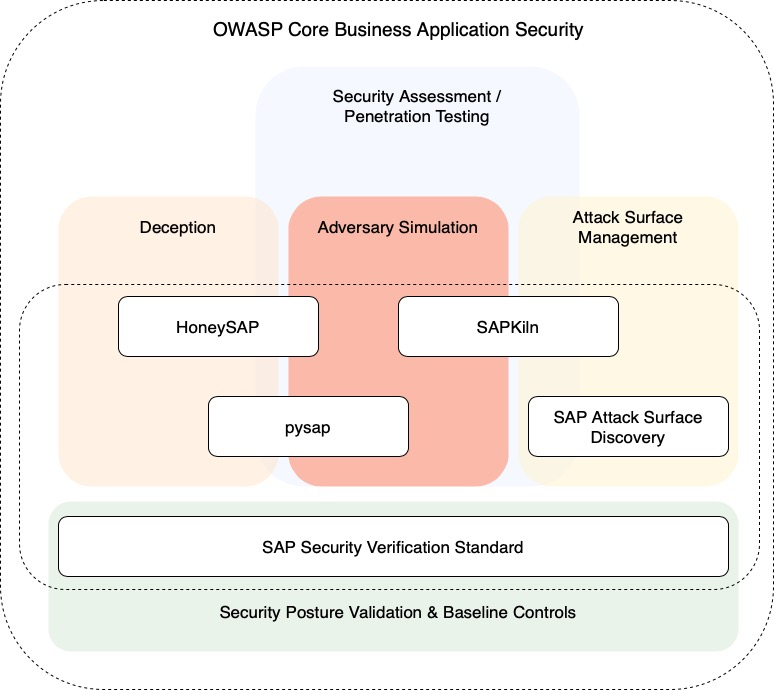

## CBAS Project Structure

## Introduction
To allow organizations using enterprise business applications to determine an achievable, tailored-to approach defining actionable targets and measurable results, with the capability to scale by strengthening people, leveraging processes, and enhancing the use of tools. The Core Business Application Security (CBAS) project is designed to combine different industry standards and expertise from various security professionals to provide a comprehensive framework to align enterprise application security measures with the organization's security strategy. As a result, a framework is created to improve the security governance of enterprise application technology.

## Background
Core business applications or enterprise business applications are beneficial to organizations in several ways. Some of these benefits include:

> - Combining different business processes under one solution
> - Improving business performance
> - Higher productivity by eliminating redundant processes
> - Flexibility and mobility
> - Easier collaboration between different organizational teams
> - Centralized data

Even though there are numerous benefits that these solutions have, security threats have not decreased. Maintaining, implementing, and deploying security controls and/or information security standards around such solutions is still facing challenges. Some of these challenges include:

> - Little to no understanding of the solutions in place
> - Security professionals not involved in the initial phases of deploying and implementing such solutions
> - Security controls being built after the solution is operational and functional; causing a blow back from business units

## NO MONKEY Security Matrix

The [NO MONKEY Security Matrix](https://www.no-monkey.com/sap-security-matrix/) is used as a governance tool throughout the different projects under the CBAS-SAP. It combines elements of the security operational functions, defined by NIST, and IPAC model, defined by NO MONKEY, into a functional graph.

Benefits and the usage of the security matrix is listed under each project of the CBAS-SAP.

[CHECK IT OUT](https://www.no-monkey.com/sap-security-matrix/)   

## SAP Security Verification Standard

The CBAS - SAP Security Verification Standard (CBAS-SSVS) project allows organizations to determine their SAP security posture based on controls used to define a maturity level that organizations can maintain or adapt to. This enables organizations to plan and enhance their security mechanisms when protecting SAP resources.

[CHECK IT OUT](https://github.com/NO-MONKEY/CBAS-SAP-SecurityMaturityModel)

## HoneySAP: SAP low-interaction honeypot

HoneySAP is a low-interaction research-focused honeypot specific for SAP services. It's aimed at learn the techniques and motivations behind attacks against SAP systems.

[CHECK IT OUT](https://github.com/OWASP/HoneySAP)

## pysap - Python library for crafting SAP's network protocols packets

[SAP Netweaver](https://www.sap.com/platform/netweaver/index.epx) and
[SAP HANA](https://www.sap.com/products/hana.html) are technology platforms for
building and integrating SAP business applications. Communication between components uses different network protocols and some services and tools make use of custom file formats as well. While some of them are standard and well-known protocols, others are proprietaries and public information is generally not available.

[pysap](https://github.com/OWASP/pysap) is an open source Python 2 library that provides modules for crafting and sending packets using SAP's `NI`, `Diag`, `Enqueue`, `Router`, `MS`, `SNC`, `IGS`, `RFC` and `HDB` protocols. In addition, support for creating and parsing different proprietary file formats is included. The modules are built on top of [Scapy](https://scapy.net/) and are based on information acquired at researching the different protocols, file formats and services.

[CHECK IT OUT](https://github.com/OWASP/pysap)

## OWASP SAPKiln

SAPKiln is an open-source GUI tool designed to empower security researchers in conducting efficient auditing and penetration testing of SAP systems through SAP Logon/GUI (desktop application). It caters to both experienced SAP professionals and those unfamiliar with the SAP environment, as it streamlines the process of performing security checks with a user-friendly interface.

[CHECK IT OUT](https://github.com/OWASP/SAPKiln)

## SAP Attack Surface Discovery

The project aims to help organizations and security professionals to identify and discover open SAP services through the use of different network scanning techniques. This allows individuals to further test these services for any potential threat that might affect SAP applications in their organizations.

[CHECK IT OUT](https://github.com/NO-MONKEY/SAP-AttackSurfaceDiscovery)

## Leaders
- [Waseem Ajrab](mailto:cbas@advisory.no-monkey.com)
- [Marco Hammel](mailto:cbas@advisory.no-monkey.com)
- [Martin Gallo](mailto:cbas@advisory.no-monkey.com)

## News and Updates Channels

Anyone interested in supporting, contributing or giving feedback join us in our discord channel.

* [Discord Channel](https://discord.gg/X8ZVSfH)
* [Slack Channel](https://join.slack.com/share/enQtNTMzNDIwOTAzOTE3NS04NWIwYTQxODIzNmNiMGE1MzU2YWE2MDkyMzNmZDlmOGQ0YWVlNGNhODg4NmIxZDQ5YTMwNjU3ZTY3MDUyYjgz)

## License

 This work is licensed under a <a rel="license" href="http://creativecommons.org/licenses/by-sa/4.0/">Creative Commons Attribution-ShareAlike 4.0 International License</a>.
