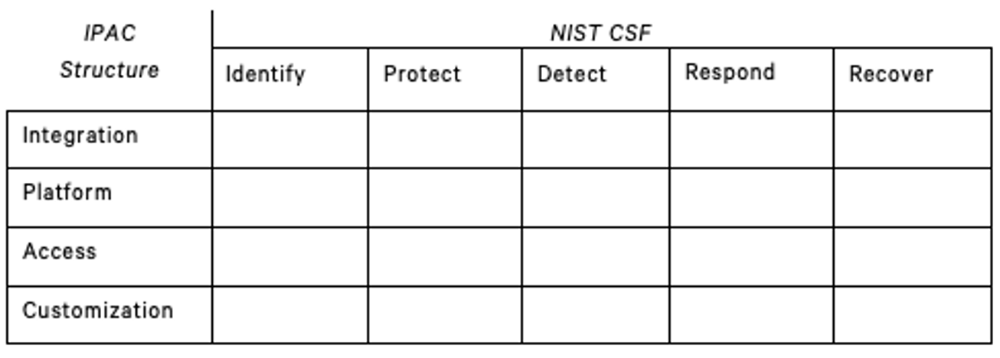

## CBAS Project Structure

   ├ __CBAS-SAP__                    
      ├── *[Security Aptitude Assessment](#security-aptitude-assessment) (SAA)*     
      ├── *[Security Maturity Model](#security-maturity-model) (SMM)*         
      └── *[SAP Internet Research](#sap-internet-research)*               

## Introduction
To allow organizations using enterprise business applications to determine an achievable, tailored-to approach defining actionable targets and measurable results, with the capability to scale by strengthening people, leveraging processes, and enhancing the use of tools. The Core Business Application Security (CBAS) project is designed to combine different industry standards and expertise from various security professionals to provide a comprehensive framework to align enterprise application security measures with the organization's security strategy. As a result, a framework is created to improve the security governance of enterprise application technology.

## Background
Core business applications or enterprise business applications are beneficial to organizations in several ways. Some of these benefits include:

> - Combining different business processes under one solution
> - Improving business performance
> - Higher productivity by eliminating redundant processes
> - Flexibility and mobility
> - Easier collaboration between different organizational teams
> - Centralized data

Even though there are numerous benefits that these solutions have, security threats have not decreased. Maintaining, implementing, and deploying security controls and/or information security standards around such solutions is still facing challenges. Some of these challenges include:

> - Little to no understanding of the solutions in place
> - Security professionals not involved in the initial phases of deploying and implementing such solutions
> - Security controls being built after the solution is operational and functional; causing a blow back from business units

## NO MONKEY Security Matrix

The [NO MONKEY Security Matrix](https://github.com/NO-MONKEY/CBAS-SAP/blob/master/No_MONKEY_Security_Matrix.md) is used as a governance tool throughout the different projects under the CBAS-SAP. It combines elements of the security operational functions, defined by NIST, and IPAC model, defined by NO MONKEY, into a functional graph.

Benefits and the usage of the security matrix is listed under each project of the CBAS-SAP.

[CHECK IT OUT](https://github.com/NO-MONKEY/CBAS-SAP/blob/master/No_MONKEY_Security_Matrix.md)   

## Security Aptitude Assessment

The CBAS - SAP Security Aptitude Assessment (CBAS-SSAA) project allows organizations to determine the skill and knowledge gaps required to secure SAP implementations in an organization.

[CHECK IT OUT](https://github.com/NO-MONKEY/CBAS-SAP-SecurityAptitudeAssessment)

## Security Maturity Model

The CBAS - SAP Security Maturity Model (CBAS-SSMM) project allows organizations to determine their SAP security posture based on controls used to define a maturity level that organizations can maintain or adapt to. This enables organizations to plan and enhance their security mechanisms when protecting SAP resources.

[CHECK IT OUT](https://github.com/NO-MONKEY/CBAS-SAP-SecurityMaturityModel)

## SAP Internet Research

With the contribution of [Joris van de Vis](mailto:joris@protect4s.com), the SAP Internet Research project aims to help organizations and security professionals to identify and discover open SAP services facing the internet. This allows individuals to further test these services for any potential threats that might affect their SAP applications.

[CHECK IT OUT](https://github.com/NO-MONKEY/CBAS-SAPInternetResearch)

## Contribution

See [CONTRIBUTING](https://github.com/NO-MONKEY/CBAS-SAP/blob/master/CONTRIBUTING.md) section for more information.    

## Leaders
- [Waseem Ajrab](mailto:cbas@advisory.no-monkey.com)
- [Marco Hammel](mailto:cbas@advisory.no-monkey.com)

## Contributors

- Joris van de Vis - [SAP Internet Research Project](https://github.com/NO-MONKEY/CBAS-SAPInternetResearch)

## Communication channel

Anyone interested in supporting, contributing or giving feedback join us in our discord channel.

* [Discord Channel](https://discord.gg/X8ZVSfH)

## License

 This work is licensed under a <a rel="license" href="http://creativecommons.org/licenses/by-sa/4.0/">Creative Commons Attribution-ShareAlike 4.0 International License</a>.
