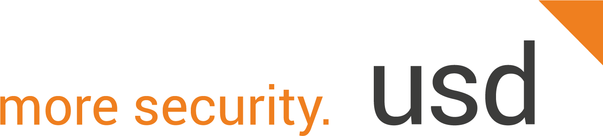

# CBAS Supporters and Contributors

We are grateful for all our supporters and contributors that have spent a significant time working on the OWASP Core Business Application Security project.

We are continuously updating and improving the different parts of the project. All contributions are welcome. [Get in touch with us to know more!](mailto:cbas@advisory.no-monkey.com)

## Supporters (Time and Donation) - Organizations

Organizations who have allowed contributors and/or donated a significant time and material on working on the different projects within the OWASP Core Business Application Security. Supporters contributing time and material will be evaluated at the sole discretion of the project leaders.

  <table style="border: none; display: inline-block;">
    <tr>
      <td style="border: none; padding: 10px;">
        
      </td>
      <td style="border: none; padding: 10px;">
        
      </td>
    </tr>
    <tr>
      <td style="border: none; padding: 10px;">
        
      </td>
      <td style="border: none; padding: 10px;">
        
      </td>
    </tr>
  </table>

## Supporters (Time and Donation) - Individuals

- Joris van de Vis - [SecurityBridge](https://securitybridge.com/) - [SAP Internet Research Project](https://github.com/NO-MONKEY/CBAS/blob/master/SAP_Internet_Research.md)
- [Marco Hammel](mailto:waseem.ajrab@no-monkey.com) - Contributor
- [Martin Gallo](mailto:cbas@advisory.no-monkey.com) - HoneySAP & pySAP
  
## Contributors

A live update of contributors can be found under each area of the OWASP Core Business Application Security project.

- [SAP Security Verification Standard](https://github.com/NO-MONKEY/CBAS-SAP-SecurityMaturityModel/graphs/contributors)
- [pySAP](https://github.com/OWASP/pysap/graphs/contributors)
- [HoneySAP](https://github.com/OWASP/HoneySAP/graphs/contributors)
- [SAP Attack Surface Discovery](https://github.com/SecuritySilverbacks/SAP-AttackSurfaceDiscovery/graphs/contributors)
- [SAPKiln](https://github.com/OWASP/SAPKiln/graphs/contributors)
- SAP Security Aptitude assessment
