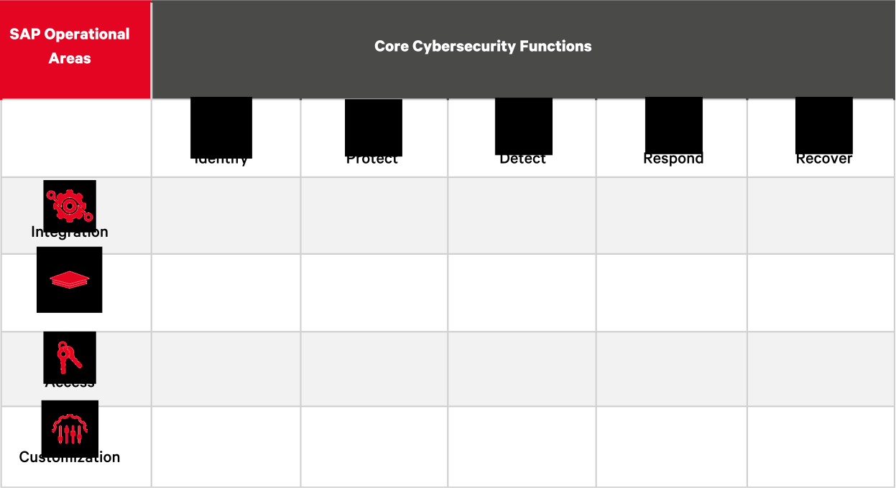

# NO MONKEY Security Matrix

The NO MONKEY Security Matrix combines elements of the security operational functions, defined by NIST, and IPAC model, created by NO MONKEY and explained below, into a functional graph.

## SAP Operational Areas

NO MONKEY has come up with the below four security areas to focus the security topics to a core business application. The areas are:

> - **Integration:** Focuses on different integration scenarios within systems and third-party tools integrating with a core business application environment, including proprietary and non-proprietary communication protocols and interfaces. Topics include secure architecture, security design, and general security operation concepts.
>
> - **Platform:** Focuses on vulnerabilities, hardening, and configuration of the core business applications. It includes reviewing security features and weaknesses in software operations, setup, and security management.
>
> - **Access:** Focuses on access control, user authorizations measures, and methodologies of SAP software.
>
> - **Customization:** Focuses on the customization of core business applications, including change management, custom code, business customizing, legacy interfaces, and add-ons.

## Applicability

The Security Matrix serves as a starting point to:

- Visually show what areas within an organization can be improved; this can be achieved throughout the different projects released.
- Identify responsibility and knowledge gaps that are aligned to the areas of the Security Matrix within the [Security Aptitude Assessment](https://github.com/NO-MONKEY/CBAS-SAP-SecurityAptitudeAssessment) project

Below is a list of projects that benefit from the NO MONKEY Security Matrix:

- [CBAS - Security Aptitude Assessment](https://github.com/NO-MONKEY/CBAS-SAP-SecurityAptitudeAssessment)
- [CBAS - Security Maturity Model](https://github.com/NO-MONKEY/CBAS-SAP-SecurityMaturityModel)
- [SAP Internet Research](https://github.com/NO-MONKEY/CBAS-SAPInternetResearch)
