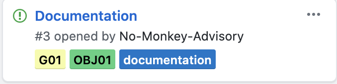

# CBAS Projects RoadMap

Objectives and goals are defined in the [Objectives](Objective_Matrix.md) document. All tasks that enable the success of a project are first raised under the [Projects](https://github.com/NO-MONKEY/CBAS/projects/1) section, and then separated through five different areas:
> - Plan
> - Development
> - Design
> - Research and Development

In order to assure the success of achieving the objectives of the CBAS project, the roadmap is designed with a set of goals to achieve each objective.

All tasks that are created to achieve a specific goal are defined in the [Projects](https://github.com/NO-MONKEY/CBAS/projects/1) section. They are converted to an **ISSUE** and placed in the **"To Do"** column of the [Projects](https://github.com/NO-MONKEY/CBAS/projects/1) section once it has been identified as a priority.

While converting tasks to issues, they should be labeled with there respective label in order to be identified properly

> Example:
> - The below task is associated to one of the goals for achieving the first objective, and so it will be labeled respectively with the **OBJ01** and **G01** labels.
>
>

On every minor or major release of different aspects of the project we conduct a simple yet effective testing mechanism:
 > - Test
 > - Adjust
 > - Implement

|Tag Legend||
|:-----|:----|
OBJ|Objective
G|Goals
