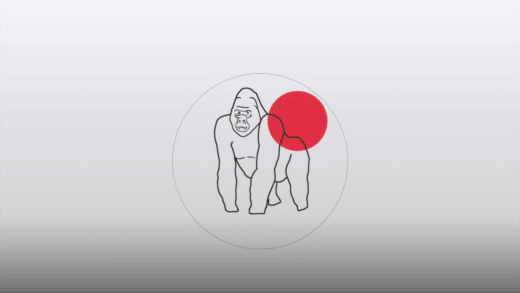

# Security Aptitude Assessment and Analysis

The CBAS - SAP Security Aptitude Assessment (CBAS-SSAA) project allows organizations to determine the skill and knowledge gaps required to secure SAP implementations in an organization.

The Security Aptitude Assessment is designed to find these gaps and map them to the [NO MONKEY Security Matrix](https://github.com/NO-MONKEY/CBAS-SAP/blob/master/No_MONKEY_Security_Matrix.md).

## Whats In It For Me (WIIFM)

Organization's and security experts can benefit from this project through:

 - Prioritize their security efforts in areas that have been identified as a high risk
 - Align and plan SAP security training for their teams to increase their knowledge and skills in protecting the SAP environment

## Getting Started

The below video illustrates how you can get started with the Security Aptitude Assessment and Analysis.

The [HOW-TO](https://github.com/NO-MONKEY/CBAS-SAP-SecurityAptitudeAssessment/blob/master/HOW_TO.md) file also gives an overview on how to start with your Security Aptitude Assessment and Analysis.

