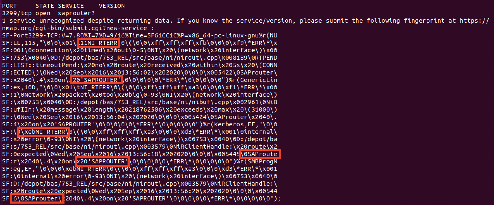
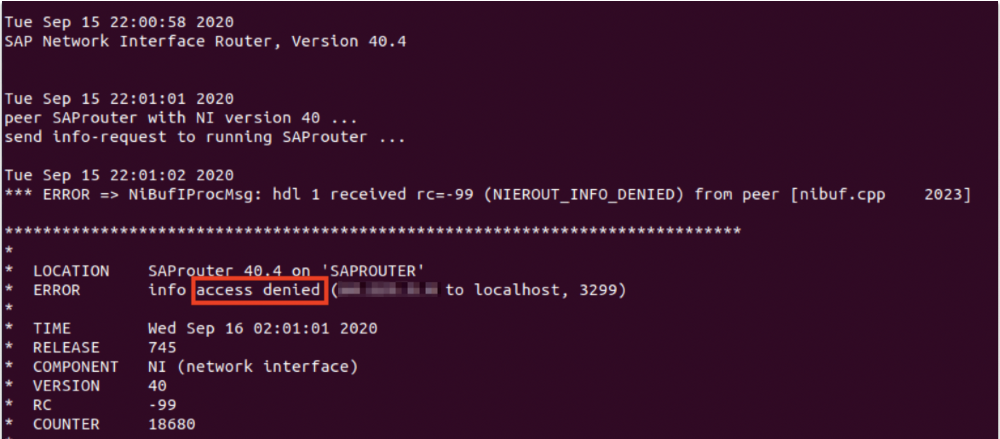
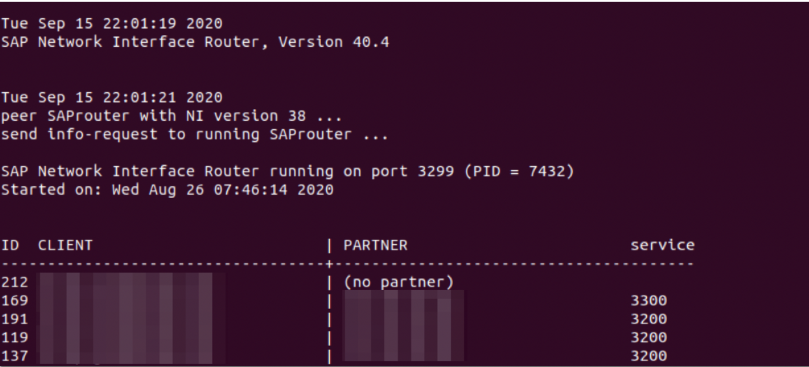

# Requirements
We have conducted our tests using __Ubuntu 20.04__ and __Windows OS__, were necessary, but the tools installation can be done on any linux distribution, or Windows OS (installation steps on Windows are not mentioned)

|Tool Name| Installation| Additional Notes|
|:--------|:------------|:----------------|
|NMAP     |*$ sudo apt install nmap* |Scan tool. Good for smaller subnets|
|NMAP ERPSCAN|*$ git clone git://github.com/gelim/nmap-erpscan*|Improves nmap capabilities when detecting SAP Services|
|ZMAP     |*$ sudo apt install zmap* |Scan tool. Was used for the full 0.0.0.0/8 range|
|Masscan  |*$ sudo apt install masscan* |Scan tool. Used for large scale analysis|
|IFSTAT   |*$ sudo apt install ifstat*|Tool used to check bandwidth|
|SAPROUTER Utilities|SAP Download Manager|Need an S-User to download the utilities|
|GIT   |*$ sudo apt install git*|Content tracker|
|Python   |*$ sudo apt install python*|Can be used for automating detection mechanisms|

## Initial steps

After installing the appropriate tools, we start by detecting SAP services that can present a risk to your organization if misused or misconfigured.

Use NMAP-ERPSCAN service probes to find open SAP services for your organization. (External and internal testing is recommended)

> __*$ git clone git://github.com/gelim/nmap-erpscan*__
>
> __*$ cd nmap-erpscan*__
>
> __*$ nmap -n --open --datadir . -sV -p $(./sap_ports.py) $TARGET*__
>> __Changing the data directory (--datadir) helps to better identify SAP services as they are not added to the default data directory of NMAP__

### SAPRouter

SAPouter [product info](https://support.sap.com/en/tools/connectivity-tools/saprouter.html) is a reverse proxy for the SAP proprietary RFC protocol. Insecurely configured SAProuter can allow an attacker to discover SAP installations behind the reverse proxy and forcing unencrypted communication. Unpatched versions are known to be vulnerable against denial of service attacks and compromise of configuration [CVE's](https://cve.mitre.org/cgi-bin/cvekey.cgi?keyword=SAProuter)

|Port | Used Tools| Additional Notes|
|:--------|:------------|:----------------|
|3299 | NMAP, SAPRouter Utilities|

If the initial scan has not identified any open ports for the SAPRouter, you can try to scan with below command specifying the SAPRouter port if it is not the default one.

> __*$ nmap -sV -n -p 3299 -Pn $TARGET -oX output_nmap_3299.txt*__
>
> Identifying SAPRouter. *Red circle shown in the image below*

 

In order to further test the SAPRouter and determine whether access is allowed or denied, you will require to download the SAPRouter utilities from the SAP download manager using you S-USER. (The S-USER is given to organizations that have deployed or is currently implementing any SAP applications)

In order to determine whether the access is allowed or not, use the below command.

> __*$ saprouter -L -H $TARGET*__

##### Access denied
 

##### Access allowed
 

The above reply shows the SAProuter connection list, this information can be very critical as it may allow routing from the internet to the internal local network, this information is usually available in and can be retrieved from the SAPROUTTAB file.

To automate the process for better detection you can use the python script *inforequest_saprouter_WIN.py* found [here](assets/SAP_Research_Tools/).

To run the script use the below syntax:
>
> __*$ python inforequest_saprouter_WIN.py $filename_with_ip_addresses*__

### SAP RFC Gateway

SAP RFC Gateway is a gateway service which standalone, or as part of an SAP ABAP system provides service for the proprietary RFC protocol. Unpatched, or misconfigured installations can yield to full system compromise. Up to unauthenticated remote code execution vulnerabilities. By default the RFC protocol is not encrypted. Communication encryption has to be setup by the use of [SNC](https://help.sap.com/viewer/e73bba71770e4c0ca5fb2a3c17e8e229/LATEST/en-US/e656f466e99a11d1a5b00000e835363f.html).

|Port | Used Tools| Additional Notes|
|:--------|:------------|:----------------|
|3300 | NMAP, NMAP erpscan|

If the initial scan has not identified any open ports for the SAP Gateway, you can try to scan with below command specifying the SAP Gateway port if it is not the default one.

> __*$ nmap -sV -R -p 3300 -Pn $TARGET*__

To automate the process for better detection you can use the files found in the 3300 zip file found [here](assets/SAP_Research_Tools). Using the python script found in the files, read the SAP info where possible (from windows machine and adjust in script sysnr=XX to correct system number):

>
> __*$ py.exe SAPinfo_WIN_v2.py $filename_with_ip_addresses*__

To check whether the gateway is vulnerable use the Gateway_Scanner_RESEARCH_V0.1.py file found [here](assets/SAP_Research_Tools)

>
> __*$ py.exe Gateway_Scanner_RESEARCH_V0.1.py $filename_with_ip_addresses*__

### SAP Internet Graphic Server

SAP Internet Graphic Server (IGS) provides services to generate web graphics. It can run standalone or intergrated in an SAP system. When certain patches are missing the IGS can be vulnerable to various [attacks](https://cve.mitre.org/cgi-bin/cvekey.cgi?keyword=SAP+IGS) yielding for example to arbitrary remote file manipulation or denial of service.

|Port | Used Tools| Additional Notes|
|:--------|:------------|:----------------|
|40080 | NMAP, NMAP erpscan|

If the initial scan has not identified any open ports for the SAP Internet Graphic Server, you can try to scan with below command specifying the SAP Internet Graphic Server port if it is not the default one.

> __*$ nmap -sV -R -p 40080 -Pn $TARGET*__

### SAP Message Server Internal Port

SAP Message Server Internal Port provides cluster management services between the application servers of an SAP system cluster. When exposed to malicious actors it can be [misused](https://github.com/gelim/sap_ms) to bypass protection configurations of the SAP RFC Gateway to allow full system compromise even when the gateway is properly configured.

|Port | Used Tools| Additional Notes|
|:--------|:------------|:----------------|
|3900 | NMAP, NMAP erpscan|

If the initial scan has not identified any open ports for the SAP Message Server Internal, you can try to scan with below command specifying the SAP Message Server Internal port if it is not the default one.

> __*$ nmap -sV -R -p 3900 -Pn $TARGET*__

### HANA Database

The HANA Database SQL client port of the systems index server provides access to the SQL/MDX functionality of the database via JDBC/ODBC. Database client for administration and development need access to this service. The encrypted communication can be configured using TLS. Wide exposure administrative database services comes with inherent risks. Specifically weak passwords, insufficient TLS configuration, hardening and patching of of the HANA system can expose an attach surface for various exploit scenarios.

|Port | Used Tools| Additional Notes|
|:--------|:------------|:----------------|
|30015 | NMAP, NMAP erpscan|

If the initial scan has not identified any open ports for the HANA Database, you can try to scan with below command specifying the HANA Database port if it is not the default one.

> __*$ nmap -sV -R -p 30015 -Pn $TARGET*__
